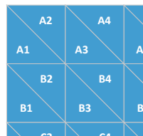

# Example ASP.NET 3 Api and Angular front end
This repository contains two projects to provide an example of a working Web Api and consuming Javascript based front end.

## Project Overview
The goal is to provide a working api that provides endpoints to return triangle labels or positions laid out on a 2 dimensional grid resembling the extract below:



This grid must then be able to be queried for any triangle by giving either:
- The label e.g A1
- A list of 3 points that can represent any triangle

The example grid constraints are:
- Limit rows A-F
- Limit columns 1-12

### Repository Structure
The repository is into two main areas:

#### Api
In the /Api folder, the API implementation is further split into two main dotnet core 3.0 projects, each with associated unit test projects:

##### Sample.Tris.Lib
A shared library that maintains grid constraints, grid address labelling and triangle query operations.

##### Sample.Tris.Tests
Unit test project associated with the Sample.Tris.Lib project

##### Sample.Tris.WebApi
An ASP.NET core 3.0 project providing the endpoints and triangle querying capabilities integrating with the shared library.

##### Sample.Tris.WebApi.Tests
Unit test project associated with the Sample.Tris.WebApi project

#### Client
In the /Client folder is an example Angular 8.0 based javascript front end providing an example integration with the API endpoints

## Building and running
Clone this repository and follow the options below for running the solution e2e:

### Docker based execution

### Manual execution

[TBD]

#### Web API

##### Requirements
- windows or linux based OS
- .NET Core 3.0 [https://dotnet.microsoft.com/download]

##### Running
Execute the following commands:

```bash
cd Api
dotnet restore
dotnet run
```

This will spin up the API and make it available at http://localhost:5000.  Note that TLS has been disabled and the cors policy has been deliberately relaxed for the purpose of this sample solution

A few request scenarios can be found in the bundled postman (https://www.getpostman.com/) collection you can find in /Api/Postman. Both the collection and environment files can be imported into a running postman instance.  The environment is configured to point at the locally running API host.

#### Front end

##### Requirements
- windows or linux based OS
- Node.js v10.15.1 or above

#### Running
```bash
cd Client
npm install -g @angular/cli
ng serve
```

This will spin up the front end angular app on url http://localhost:4200 configured to point at the running API instance

